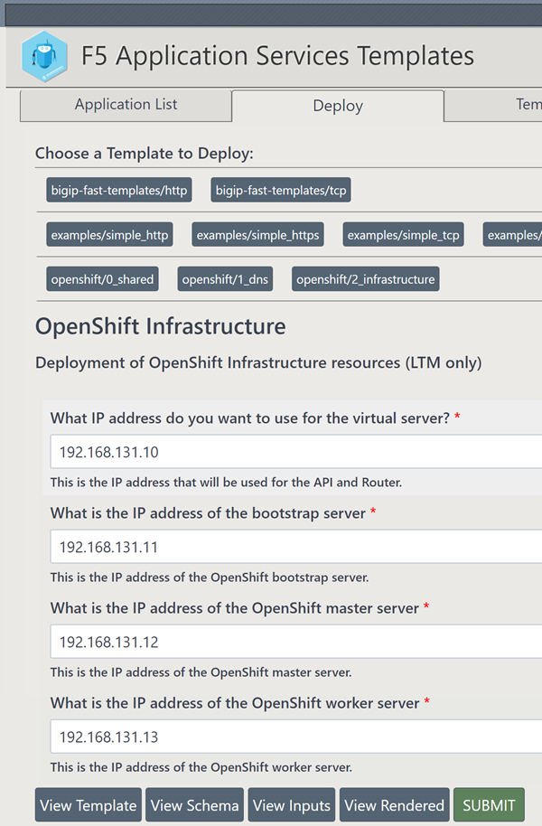

# Openshift-4-3

[FAST template](https://clouddocs.f5.com/products/extensions/f5-appsvcs-templates/latest/) of OpenShift 4.x deployment.  Can be deployed either as LTM only (infrastructure.yaml), DNS only (shared.yaml/dns.yaml), or combined.

* shared.yaml: Shared resources for DNS
* dns.yaml: DNS entries
* infrastructure.yaml: LTM entries



## Requirements

* 1.1.0 >= F5 FAST
* 3.20.0 >= F5 AS3
* BIG-IP LTM
* BIG-IP DNS (optional)

## Building

```
$ zip shared.yaml dns.yaml infrastructure.yaml openshift.zip
```
Upload the openshift.zip template set.

## Sample Inputs

Shared resources (create first)
```
[
  {
    "name": "openshift/shared",
    "parameters": {
      "base_domain": "dc1.example.com",
      "self_address": "192.168.1.201",
      "virtual_address": "192.168.131.10"
    }
  }
]
```
DNS and LTM
```
[
  {
    "name": "openshift/dns",
    "parameters": {
      "base_domain": "dc1.example.com",
      "virtual_address": "192.168.131.10",
      "bootstrap_address": "192.168.131.11",
      "master_address": "192.168.131.12",
      "worker_address": "192.168.131.13",
      "external_dns_address": "192.168.1.1"
    }
  },
  {
    "name": "openshift/infrastructure",
    "parameters": {
      "virtual_address": "192.168.131.10",
      "bootstrap_address": "192.168.131.11",
      "master_address": "192.168.131.12",
      "worker_address": "192.168.131.13"
    }
  }
]
```

